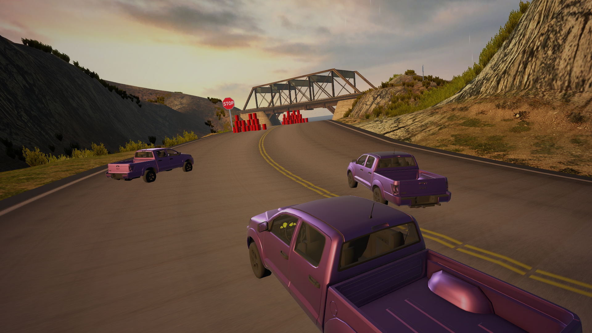

# Machine Learning Transfer Research: Simulation Prototype

<p align="center">
    
</p>

Simulation prototype for the research project: [**Evaluating transfer learning for reinforcement learning agents across same-genre video games**](https://github.com/Machine-Learning-Transfert-Research) <br>
Research project carried out in partnership between [PulluP Entertainment](https://pullupent.com/en) and [ISART Digital Paris](https://www.isart.fr/)

<p align="center">
    
    
</p>

## Table of Content
- [Presentation](#presentation)
- [Setup](#setup)
- [Technology](#technology)
- [Credits](#credits)

## Presentation 
This project was developed in **Unity** by a team of four to prototype a simulation racing game in order to train on it, an agent with machine learning and transfer it to the other prototype we made, an [Arcade prototype](https://github.com/Machine-Learning-Transfert-Research/Arcade-Prototype).

## Setup
Warning: Make sure to have installed the python environment

### Start a training session
In [**Anaconda Prompt**](https://www.anaconda.com/download) or [**MiniForge Prompt**](https://conda-forge.org/download/)
1. Go to the project folder
2. Activate the python environment
``` 
conda activate mlagents
```
3. Start training
```
mlagents-learn config/AgentSimulationBehavior_config.yaml --run-id=Training_Name
```

In **Unity** 
1. Open the scene ```Assets/Scenes/Training```
2. **Launch** the scene

### Test trained agents
In **Unity** 
1. Open the scene ```Assets/Scenes/MainCircuit```
2. Get an ```.onnx``` file from the folder ```Result``` in the ```Assets/Results```
3. In the *Hierarchy* ```Car Pickup``` GameObject
4. In the *Inspector* ```Behavior Parameters``` Script
5. Change the parameters ```Model``` with the neural network you want to test. Make sure that ```Behavior Type``` is set to *Inference Only*
4. **Launch** the scene

### Play agent
---
1. Open either the scene **MainCircuit** or **Training**
2. On the car pickup, in the component Behavior Parameters 
    - Change the Behavior Type to *Heuristic Only*

## Technology
- Unity 6 *v6000.3.9f1*
- [ML Agents Plugin](https://docs.unity3d.com/Packages/com.unity.ml-agents@4.0/manual/index.html) *(version 4.0.2)*

## Citation and Details

This work as been published as a short paper at IEEE CoG 2026:
```bibtex
B. Bachelet, V. Devine, M. Erbisti, O. Lise, A. Lherbier and A. Chambon, "Evaluating transfer learning for reinforcement learning agents across same-genre video games," IEEE Conference on Games 2026, Madrid, Spain, 2026
```

## Credits
- [Bryan BACHELET](https://www.linkedin.com/in/bryan-bachelet/)
- [Vincent DEVINE](https://www.linkedin.com/in/vincent-devine/)
- [Matéo ERBISTI](https://www.linkedin.com/in/mat%C3%A9o-erbisti/)
- [Omaya LISE](https://www.linkedin.com/in/omaya-lise/)
- [Aurelien CHAMBON](https://www.linkedin.com/in/aurelien-chambon/)
- [Aurélien LHERBIER](https://www.linkedin.com/in/aur%C3%A9lien-lherbier-a344993b/)

## ⚖️ License

MIT — see [LICENSE](LICENSE). Use it, hack it, ship it. Just don't blame me when your hexapod achieves sentience and files for emancipation.

### Assets
- [Vehicle Physics Pro](https://vehiclephysics.com/)
- [Dreamteck Spline by Dreamteck](https://assetstore.unity.com/packages/tools/utilities/dreamteck-splines-61926)
